# TechMock AI — Informe de Avance

<div align="center">


</div>

---

| Campo | Detalle |
|---|---|
| **Curso** | COM610 |
| **Proyecto** | TechMock AI — Plataforma de simulación de entrevistas técnicas con IA |
| **Fecha del informe** | 17 de junio de 2026 |
| **Integrante** | Limachi Villarroel Alan Nicolas |
| **Grupo** | Grupo 6 |
| **Repositorio** | https://github.com/AlanDevPro/techmock-ai.git |


---

## Índice

1. [Resumen Ejecutivo](#1-resumen-ejecutivo)
2. [Descripción del Sistema](#2-descripción-del-sistema)
3. [Stack Tecnológico](#3-stack-tecnológico)
4. [Infraestructura y Servicios AWS](#4-infraestructura-y-servicios-aws)
5. [Descripción Detallada de cada Componente](#5-descripción-detallada-de-cada-componente)
6. [Diagrama de Arquitectura](#6-diagrama-de-arquitectura)
7. [Funcionalidad del Sistema](#7-funcionalidad-del-sistema)
   - 7.1 [Panel de Administrador](#71-panel-de-administrador)
   - 7.2 [Panel del Developer](#72-panel-del-developer)
8. [Evidencia Fotográfica](#8-evidencia-fotográfica)
   - 8.1 [Infraestructura AWS — EC2 / ALB](#81-infraestructura-aws--ec2--alb)
   - 8.2 [Base de Datos — RDS](#82-base-de-datos--rds)
   - 8.3 [Búsqueda Vectorial — OpenSearch](#83-búsqueda-vectorial--opensearch)
   - 8.4 [Correo Transaccional — SES](#84-correo-transaccional--ses)
   - 8.5 [Contenedores Docker](#85-contenedores-docker)
   - 8.6 [Funcionalidad del Sistema — Admin](#86-funcionalidad-del-sistema--admin)
   - 8.7 [Funcionalidad del Sistema — Developer](#87-funcionalidad-del-sistema--developer)
9. [Bitácora de Avance](#9-bitácora-de-avance)
10. [Comandos Principales Utilizados](#10-comandos-principales-utilizados)
11. [Pendientes y Próximos Pasos](#11-pendientes-y-próximos-pasos)
12. [Glosario de Términos](#12-glosario-de-términos)
13. [Control de Versiones del Documento](#13-control-de-versiones-del-documento)

---

## 1. Resumen Ejecutivo

**TechMock AI** es una plataforma que simula entrevistas técnicas de programación utilizando Inteligencia Artificial. El sistema permite a desarrolladores junior resolver ejercicios de código en un entorno tipo IDE, mientras un modelo de lenguaje (LLM), apoyado en una arquitectura RAG (*Retrieval-Augmented Generation*), genera preguntas de entrevista personalizadas, evalúa las respuestas en tiempo real y produce recomendaciones técnicas detalladas.

### Objetivo General

Desplegar una plataforma funcional de simulación de entrevistas técnicas, desacoplada en servicios independientes, sobre infraestructura AWS, con autenticación segura y trazabilidad completa de la evaluación del candidato.

### Alcance de Este Avance

- ✅ Despliegue de **4 instancias EC2** (frontend, backend, editor de código, RAG API), cada una contenerizada con Docker.
- ✅ Configuración de un **Application Load Balancer (ALB)** con enrutamiento basado en rutas hacia los 4 servicios.
- ✅ Implementación de una **base de datos relacional en Amazon RDS** (PostgreSQL) con sistema de migraciones versionado.
- ✅ Integración de **Amazon OpenSearch Service** como motor de búsqueda vectorial para el sistema RAG.
- ✅ Configuración de **Amazon SES** para el envío de correos de recuperación de contraseña.
- ✅ Implementación de **autenticación dual** (Firebase + JWT propio) en el backend.
- ✅ Interfaces funcionales para los roles de **Administrador** y **Developer**.

### Fuera de Alcance en Este Avance

Monitoreo y alertas (CloudWatch), CDN/CloudFront, autoescalado, pruebas de carga.

---

## 2. Descripción del Sistema

TechMock AI está diseñada para ayudar a **desarrolladores junior** a prepararse para entrevistas técnicas reales, practicando en un entorno simulado y obteniendo retroalimentación detallada generada por IA.

### Roles del Sistema

El sistema cuenta con dos roles principales:

| Rol | Descripción |
|---|---|
| 🛡️ **Administrador** | Gestiona usuarios, sesiones, preguntas, tecnologías y accesos de reclutadores. Tiene visibilidad total de la plataforma. |
| 👨‍💻 **Developer** | Accede a sesiones de entrevista simuladas, practica en el IDE integrado, recibe evaluaciones de IA y consulta su progreso y ranking. |

### Flujo Principal

```
Developer selecciona tecnología
        ↓
IA genera preguntas técnicas (RAG)
        ↓
Developer resuelve en el IDE integrado
        ↓
IA evalúa el código y genera recomendaciones
        ↓
Sistema registra progreso, errores y puntaje
        ↓
Ranking actualizado en tiempo real
```

---

## 3. Stack Tecnológico

| Capa | Tecnología | Detalle / Versión |
|---|---|---|
| **Frontend** | Next.js (React, TypeScript) | Aplicación principal de la plataforma |
| **Editor de código (IDE)** | Next.js + Monaco Editor | `basePath: "/editor"` — entorno tipo VSCode |
| **Backend** | Node.js + Express, TypeScript | Auth dual: Firebase + JWT propio |
| **RAG API** | Python + FastAPI | Orquestación RAG, SQLAlchemy async |
| **Modelos LLM** | Groq (predeterminado), OpenAI, Anthropic, Ollama | Cliente multi-proveedor configurable por `.env` |
| **Embeddings** | BGE local (`BAAI/bge-small-en-v1.5`) | Generados antes de indexar en OpenSearch |
| **Base de datos** | PostgreSQL (Amazon RDS) | Migraciones idempotentes con tabla `schema_migrations` |
| **Búsqueda vectorial** | Amazon OpenSearch Service | Autenticación SigV4 (`boto3` + `requests-aws4auth`) |
| **Correo transaccional** | Amazon SES | Recuperación de contraseña con token JWT de un solo uso |
| **Identidad** | Firebase Authentication | Capa complementaria al JWT propio (Google/GitHub login) |
| **Contenedores** | Docker, Docker Compose | Build multi-stage por servicio |
| **Balanceo de carga** | AWS Application Load Balancer (ALB) | Enrutamiento por *path* a 4 *target groups* |
| **Control de versiones** | Git + GitHub | `[completar URL del repositorio]` |

---

## 4. Infraestructura y Servicios AWS

| # | Servicio | Recurso AWS | Región | Función | Puerto interno | Estado | Dependencias |
|---|---|---|---|---|---|---|---|
| 1 | Frontend | EC2 (Next.js + Docker) | `us-east-1d` | Interfaz de usuario principal | `3000` → ALB `/` | 🟩 Operativo | Backend, ALB |
| 2 | Backend | EC2 (Node.js/Express + Docker) | `us-east-1d` | API REST, auth dual, lógica de negocio | `4000` → ALB `/api/*` | 🟩 Operativo | RDS, Firebase, SES, ALB |
| 3 | Editor de código | EC2 (Next.js + Docker) | `us-east-1f` | IDE donde el developer resuelve ejercicios | `3001` → ALB `/editor/*` | 🟩 Operativo | Frontend, Backend, ALB |
| 4 | RAG API | EC2 (FastAPI + Docker) | `us-east-1f` | Generación de preguntas + evaluación con IA | `8000` → ALB `/rag/*` | 🟩 Operativo | RDS, OpenSearch, LLM externos, ALB |
| 5 | Base de datos | Amazon RDS (PostgreSQL) | `us-east-1f` | Persistencia de usuarios, sesiones, evaluaciones, perfiles técnicos | `5432` | 🟩 Operativo | Backend, RAG API |
| 6 | Búsqueda vectorial | Amazon OpenSearch Service | `US East (N. Virginia)` | Indexación y *retrieval* de embeddings para RAG | Puerto HTTPS | 🟩 Operativo | RAG API |
| 7 | Correo transaccional | Amazon SES | `EE. UU. (Norte de Virginia)` | Envío de correos de recuperación de contraseña | API SES | 🟩 Operativo | Backend |
| 8 | Balanceador de carga | Application Load Balancer | `us-east-1d - us-east-1f` | Enrutamiento por *path* hacia los 4 servicios | `443 / 80` público | 🟩 Operativo | Las 4 EC2 |


---

## 5. Descripción Detallada de cada Componente

### 🖥️ Frontend (EC2 + Docker, Next.js)

Aplicación principal que los usuarios consumen directamente desde el navegador. Orquesta la navegación entre el flujo de autenticación, el dashboard del candidato, el editor de código embebido y los distintos paneles según el rol (Admin / Developer). Se construye con un Dockerfile multi-stage que separa la etapa de compilación de la de ejecución, reduciendo el tamaño final de la imagen y mejorando los tiempos de arranque en producción.

### ⚙️ Backend (EC2 + Docker, Node.js / Express)

Expone la API REST consumida por el frontend y el editor. Implementa una arquitectura de autenticación dual: **Firebase** como capa de identidad (registro, login social con Google y GitHub) y un sistema de **JWT propio** para la gestión de sesiones y autorización dentro de la plataforma. Gestiona el envío de correos de recuperación de contraseña a través de Amazon SES, usando tokens JWT de un solo uso con tiempo de expiración configurable.

### 💻 Editor de Código / IDE (EC2 + Docker, Next.js + Monaco Editor)

Entorno de edición tipo VSCode donde el candidato resuelve los ejercicios planteados durante la entrevista simulada. Se desplegó con `basePath: "/editor"` en la configuración de Next.js para que las rutas internas coincidan con la regla de enrutamiento `/editor/*` configurada en el ALB. Incluye resaltado de sintaxis, autocompletado y soporte multi-lenguaje.

### 🤖 RAG API (EC2 + Docker, FastAPI + Python)

Servicio en Python encargado de generar las preguntas de entrevista y evaluar las respuestas del candidato mediante un modelo de lenguaje. Implementa el patrón **RAG (Retrieval-Augmented Generation)**:

1. Recupera contexto relevante (conceptos, frameworks, errores comunes) desde Amazon OpenSearch usando embeddings vectoriales.
2. Construye un *prompt* enriquecido con ese contexto.
3. Envía el prompt al LLM activo (**Groq** por defecto, con soporte alternativo para OpenAI, Anthropic y Ollama).
4. Retorna la pregunta generada o la evaluación detallada del código del candidato.

### 🗄️ Base de Datos (Amazon RDS — PostgreSQL)

Almacena el modelo de datos completo de la plataforma: usuarios, perfiles técnicos, sesiones de entrevista, preguntas generadas, errores detectados, recomendaciones de solución, rankings y vistas para el panel del reclutador. El control de versiones del esquema se realiza mediante una tabla `schema_migrations` y un script maestro que aplica las migraciones de forma **idempotente**, permitiendo reejecuciones seguras en distintos entornos.

### 🔍 Motor de Búsqueda Vectorial (Amazon OpenSearch Service)

Almacena los embeddings generados localmente con el modelo BGE (`BAAI/bge-small-en-v1.5`), los cuales representan conceptos técnicos y fragmentos de conocimiento. La RAG API consulta OpenSearch mediante búsqueda **k-NN** para recuperar el contexto más relevante dado el tema de la entrevista en curso. El acceso se autentica con **AWS SigV4** para cumplir con las políticas de seguridad del dominio de OpenSearch.

### 📧 Correo Transaccional (Amazon SES)

Utilizado por el backend para enviar el correo de recuperación de contraseña cuando un usuario solicita restablecer su clave. Se genera un token JWT de un solo uso con expiración corta, el cual se incluye en el enlace del correo. Las credenciales de acceso a SES se obtienen mediante el rol IAM asignado a la instancia EC2 (`fromInstanceMetadata()`), evitando exponer claves en variables de entorno.

### ⚖️ Balanceador de Carga (Application Load Balancer)

Punto de entrada único de la plataforma. Enruta el tráfico HTTP/HTTPS hacia el servicio correspondiente según el *path* de la solicitud, utilizando 4 *target groups* (uno por servicio) con reglas de prioridad configuradas en el *listener*:

| Regla | Path | Target Group |
|---|---|---|
| 1 | `/rag/*` | `rag-tg` |
| 2 | `/editor/*` | `editor-tg` |
| 3 | `/api/v1/*` | `backend-tg` |
| 4 | `default` | `frontend-tg` |

---

## 6. Diagrama de Arquitectura

> La siguiente imagen muestra la arquitectura completa del sistema TechMock AI desplegada en AWS, incluyendo el flujo de comunicación entre el ALB, las instancias EC2, RDS, OpenSearch y SES.

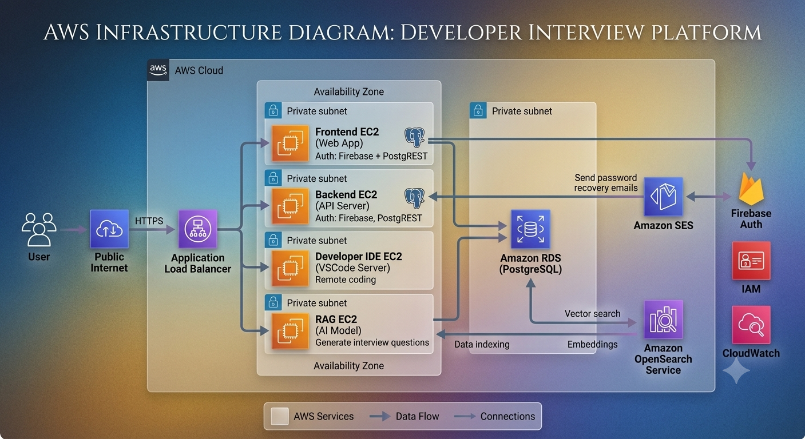

*Diagrama de arquitectura del sistema TechMock AI sobre infraestructura AWS. Se observan las 4 instancias EC2 detrás del ALB con enrutamiento por path, la base de datos RDS PostgreSQL, el clúster de OpenSearch para embeddings vectoriales y el servicio SES para correos transaccionales.*

---

## 7. Funcionalidad del Sistema

TechMock AI implementa dos roles bien diferenciados con interfaces y capacidades propias: el **Administrador**, que gestiona la plataforma de forma global, y el **Developer**, que interactúa con el sistema para practicar entrevistas técnicas.

---

### 7.1 Panel de Administrador

El administrador cuenta con un panel de control completo que le permite supervisar y gestionar todos los aspectos operativos de la plataforma.

#### 📊 Dashboard Principal (Admin)

Vista general de métricas clave de la plataforma: número de sesiones activas, total de usuarios registrados, preguntas generadas en el último período y tasa de evaluaciones completadas. Permite al administrador tener un pulso en tiempo real de la actividad del sistema.

#### 👥 Panel de Usuarios

Gestión completa del directorio de usuarios registrados en la plataforma. Permite buscar, filtrar y visualizar el perfil de cada developer, así como activar, suspender o eliminar cuentas. Muestra información relevante como tecnologías practicadas, fecha de registro y estado de actividad.

#### 🗂️ Panel de Sesiones

Listado y detalle de todas las sesiones de entrevista realizadas en la plataforma. El administrador puede revisar el historial de una sesión específica: qué preguntas se generaron, cuánto tiempo tomó el developer, qué puntaje obtuvo y qué errores cometió. Útil para auditoría y control de calidad del sistema RAG.

#### ❓ Panel de Preguntas

Repositorio centralizado de las preguntas generadas por la IA. Permite revisar, aprobar o marcar preguntas como obsoletas según los estándares de calidad de la plataforma. También posibilita categorizar preguntas por tecnología, nivel de dificultad y tipo de entrevista.

#### 🛠️ Panel de Tecnologías

Administración del catálogo de tecnologías disponibles para practicar en la plataforma (Vue.js, React, Next.js, TypeScript, Node.js, entre otras). El administrador puede agregar nuevas tecnologías, definir conceptos clave asociados y configurar los parámetros que guían la generación de preguntas del sistema RAG.

#### 📋 Panel de Evaluaciones

Acceso al historial de evaluaciones realizadas por el modelo de IA sobre el código de los developers. El administrador puede visualizar los criterios de evaluación aplicados, los puntajes otorgados, las fortalezas y debilidades detectadas, así como las recomendaciones generadas automáticamente para cada sesión.

#### 🤝 Panel de Reclutamientos

Módulo de vinculación entre reclutadores y developers destacados. El administrador gestiona los accesos de reclutadores a la plataforma, los perfiles que pueden consultar y los contactos habilitados. Permite configurar las vistas disponibles para el rol de reclutador dentro del sistema.

#### 🔔 Notificaciones

Centro de notificaciones del administrador: alertas sobre nuevos usuarios registrados, sesiones completadas, errores del sistema RAG, solicitudes de contacto de reclutadores y actualizaciones relevantes de la plataforma. Permite mantener un seguimiento activo sin necesidad de revisar cada módulo manualmente.

#### 👤 Perfil del Administrador

Sección de configuración personal del administrador: edición de datos de perfil, cambio de contraseña, preferencias de notificación y gestión de accesos a la plataforma.

#### 🏆 Tabla de Clasificación de Developers

Ranking global de todos los developers registrados en la plataforma, ordenados por puntaje acumulado. El administrador puede visualizar el desempeño comparativo de los usuarios, filtrar por tecnología o período de tiempo, e identificar a los candidatos con mayor progreso para facilitar su conexión con reclutadores.

---

### 7.2 Panel del Developer

El developer tiene acceso a una interfaz centrada en la práctica y el crecimiento profesional, con retroalimentación detallada en cada etapa.

#### 🏠 Dashboard del Developer

Vista principal del developer al ingresar a la plataforma. Muestra:
- **Tecnologías disponibles para practicar:** catálogo completo de tecnologías con las que puede iniciar una nueva sesión de entrevista (React, Vue.js, TypeScript, Node.js, Next.js, entre otras), presentadas como tarjetas interactivas con su nivel de dificultad.
- **Tecnologías en progreso:** acceso rápido a las tecnologías en las que el developer ya ha iniciado sesiones anteriores y desea continuar practicando, con indicador visual del porcentaje de avance.

#### 👤 Mi Perfil

Página de perfil personal del developer con información profesional, tecnologías dominadas, estadísticas de sesiones completadas y un **radar chart** que visualiza su nivel de competencia en cada área técnica evaluada. También permite editar datos personales y preferencias de la cuenta.

#### 📈 Panel de Progreso

Vista detallada del avance técnico del developer a lo largo del tiempo. Incluye:
- **Fortalezas detectadas:** conceptos y habilidades donde el developer muestra consistentemente buen desempeño, identificadas por el modelo de IA a través de múltiples sesiones.
- **Debilidades y áreas de mejora:** aspectos técnicos donde el developer presenta dificultades recurrentes, con recomendaciones específicas de estudio.
- **Mejores prácticas:** sugerencias del modelo de IA para mejorar la calidad del código según los estándares de la industria.
- **Últimas sesiones:** historial de las sesiones más recientes con resumen de desempeño, fecha, tecnología practicada y puntaje obtenido.

#### ❌ Errores Cometidos en la Entrevista

Panel dedicado al registro detallado de los errores identificados por la IA durante las sesiones de entrevista. Muestra la categoría del error (lógico, sintáctico, de rendimiento, de arquitectura), la frecuencia con la que se repite y recursos o explicaciones para corregirlos. Es una herramienta clave para el aprendizaje iterativo del developer.

#### 🏅 Tabla de Ranking

Clasificación global donde el developer puede ver su posición actual en comparación con todos los demás developers registrados en la plataforma. Incluye podio visual para los tres primeros lugares, posición propia destacada, puntaje acumulado y opción de filtrar el ranking por tecnología específica o período de tiempo.

#### 💻 IDE — Editor de Código

Entorno de programación integrado donde el developer recibe la pregunta generada por la IA y escribe su solución en tiempo real. Características principales:
- Editor con resaltado de sintaxis estilo Monaco (VSCode).
- Soporte para múltiples lenguajes de programación.
- La pregunta generada por la IA se muestra en el panel lateral para que el developer la consulte durante el desarrollo.
- Botón de envío para que el modelo de IA procese y evalúe el código una vez finalizado.

#### 📊 Panel de Rendimiento — Evaluación del Código

Una vez que el developer envía su solución, el modelo de IA genera una evaluación detallada que se presenta en este panel. Incluye:
- **Puntaje general** con anillos de puntuación animados por dimensión (correctitud, eficiencia, buenas prácticas, legibilidad).
- **Análisis del código:** descripción de qué hizo bien el developer y qué aspectos pueden mejorar.
- **Errores detectados:** listado específico de los problemas encontrados en el código enviado.
- **Recomendaciones personalizadas:** acciones concretas que el developer puede tomar para mejorar su solución y su nivel técnico general.

---

## 8. Evidencia Fotográfica

Las capturas están organizadas por sección dentro de la carpeta `techmock-informe/capturas/`. Cada imagen incluye una breve descripción de su contenido.

---

### 8.1 Infraestructura AWS — EC2 / ALB

> Esta sección muestra el estado operativo de las instancias EC2 y la configuración del balanceador de carga en la consola de AWS.

---

#### Instancias EC2

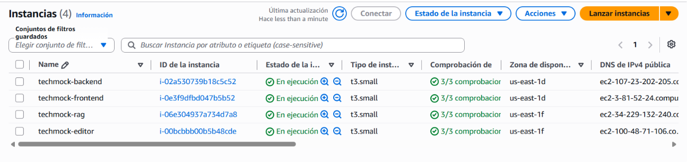

*Vista del listado de instancias EC2 en la consola de AWS. Se muestran las 4 instancias del proyecto (frontend, backend, editor y RAG API) con su nombre, estado `Running` e identificador de instancia.*

---

#### Reglas del Listener — ALB

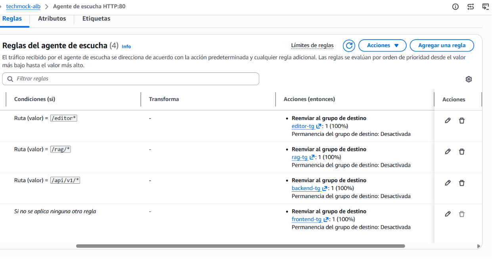

*Configuración de las reglas del listener HTTP/HTTPS en el Application Load Balancer. Se observan las 4 reglas de enrutamiento por path con su prioridad: `/rag/*`, `/editor/*`, `/api/v1/*` y la regla `default` hacia el frontend.*

---

#### Target Group — Frontend

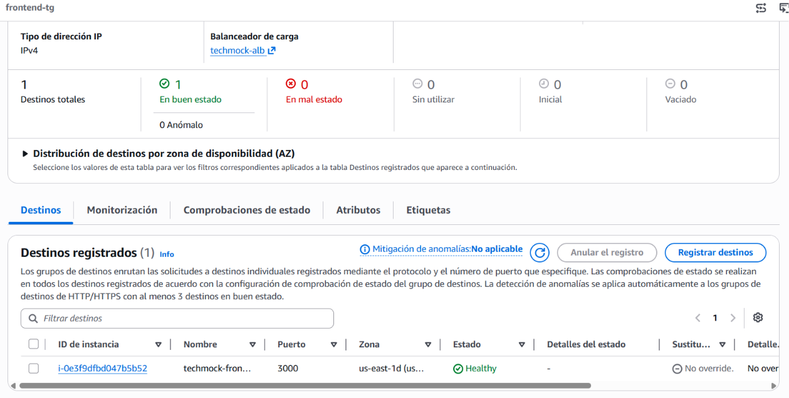

*Estado del target group `frontend-tg`. Se muestra la instancia EC2 registrada con estado `healthy`, confirmando que el health check del servicio de Next.js responde correctamente a través del ALB.*

---

#### Target Group — Backend


*Estado del target group `backend-tg`. Se muestra la instancia EC2 del servicio Node.js/Express con estado `healthy`, verificando que la API REST está accesible y respondiendo en el puerto configurado.*

---

#### Target Group — Editor de Código

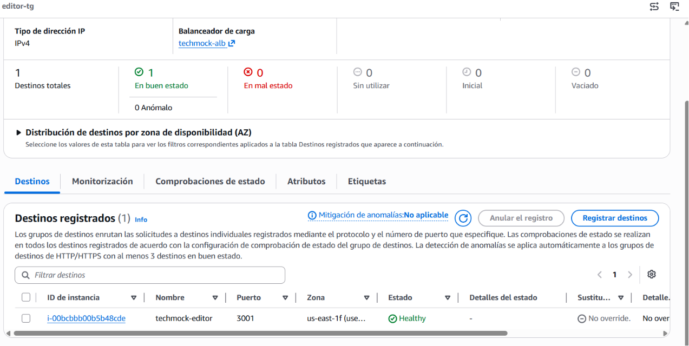

*Estado del target group `editor-tg`. Se muestra la instancia EC2 del IDE con estado `healthy`. El health check está configurado para el prefijo `/editor` conforme al `basePath` definido en Next.js.*

---

#### Target Group — RAG API


*Estado del target group `rag-tg`. Se muestra la instancia EC2 del servicio FastAPI con estado `healthy`, verificando que el endpoint de la RAG API responde correctamente a las solicitudes del ALB.*

---

#### Security Groups


*Configuración de los Security Groups asociados a las instancias EC2. Se observan las reglas de entrada y salida que controlan el tráfico permitido entre el ALB, las instancias y los servicios de RDS y OpenSearch.*

---

### 8.2 Base de Datos — RDS

> Esta sección evidencia la configuración y disponibilidad de la instancia PostgreSQL en Amazon RDS.

---

#### Detalle de la Instancia RDS

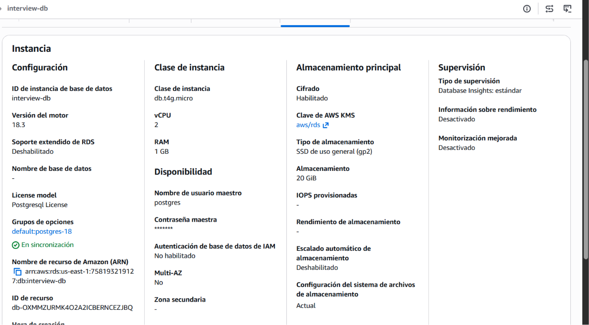

*Vista de detalle de la instancia de base de datos en Amazon RDS. Se muestran el estado `Available`, el motor PostgreSQL, el endpoint de conexión y el puerto 5432 habilitado para los servicios del backend y la RAG API.*

---

#### Migraciones Aplicadas

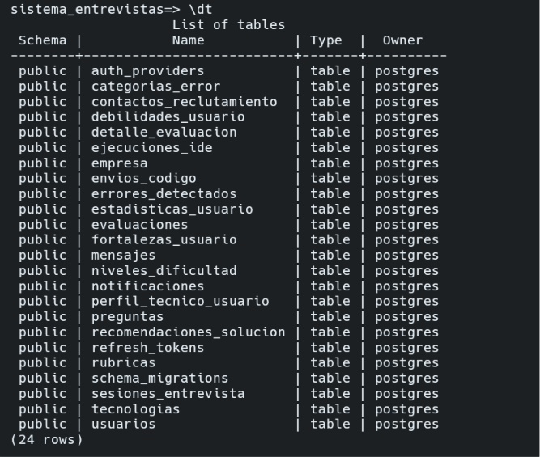

*Resultado de la consulta `SELECT * FROM schema_migrations` ejecutada sobre la base de datos en RDS. Se evidencian las migraciones idempotentes aplicadas correctamente mediante el script maestro, incluyendo las tablas del sistema adaptativo de entrevistas.*

---

### 8.3 Búsqueda Vectorial — OpenSearch

> Esta sección muestra el estado del clúster de OpenSearch utilizado para la indexación y recuperación de embeddings en el sistema RAG.

---

#### Dominio de OpenSearch

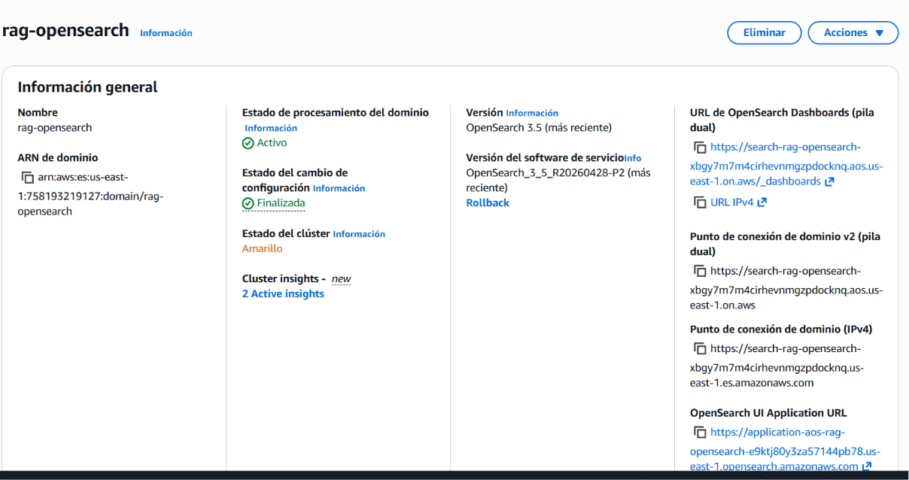

*Vista del dominio de Amazon OpenSearch Service en la consola de AWS. Se muestra el estado `Active` del clúster, el endpoint HTTPS para acceso SigV4 y la configuración de nodos del dominio `techmock-vectors`.*

---

### 8.4 Correo Transaccional — SES

> Esta sección evidencia la configuración de Amazon SES para el envío de correos de recuperación de contraseña.

---

#### Identidades Verificadas en SES


*Vista del panel de identidades verificadas en Amazon SES. Se muestra el dominio o dirección de correo con estado `Verified`, habilitado para el envío de correos transaccionales de recuperación de contraseña desde el backend de la plataforma.*

---

#### Estadísticas de Envío SES

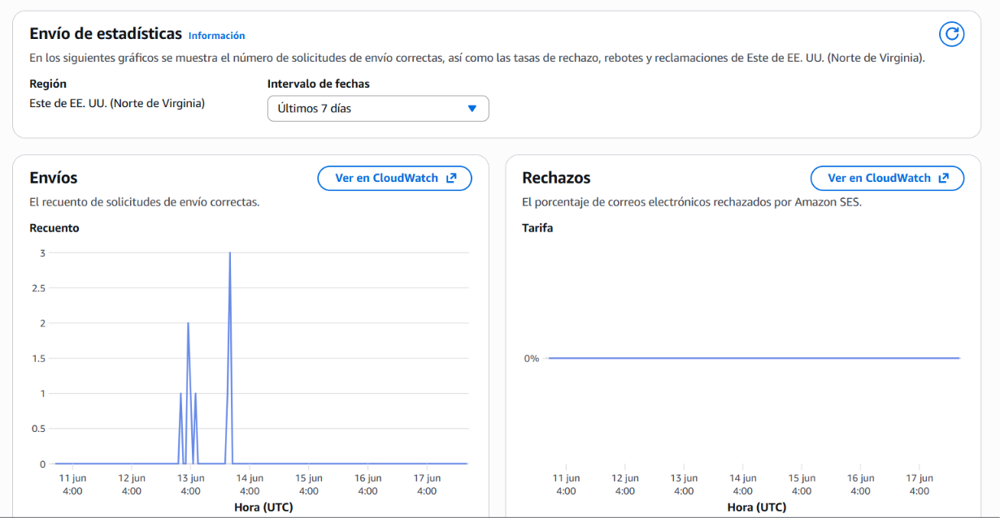

*Dashboard de estadísticas de envío de Amazon SES. Se visualizan métricas de correos enviados, entregados y tasas de rebote, verificando el correcto funcionamiento del servicio de notificaciones transaccionales.*

---

### 8.5 Contenedores Docker

> Esta sección muestra el estado de los contenedores Docker en ejecución dentro de cada instancia EC2.

---

#### Docker en EC2 — Frontend

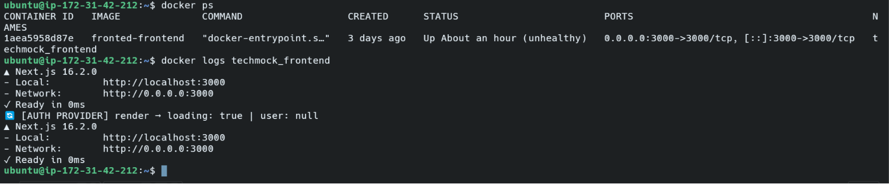

*Salida del comando `docker ps` ejecutado en la instancia EC2 del frontend. Se muestra el contenedor de Next.js con estado `Up`, la imagen multi-stage utilizada, el puerto mapeado `3000` y el tiempo de ejecución activo.*

---

#### Docker en EC2 — Backend


*Salida del comando `docker ps` ejecutado en la instancia EC2 del backend. Se muestra el contenedor de Node.js/Express con estado `Up`, el puerto `4000` mapeado y el nombre del contenedor correspondiente al servicio de API REST.*

---

#### Docker en EC2 — Editor de Código

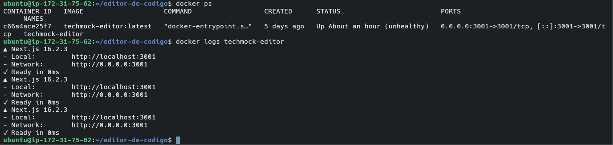

*Salida del comando `docker ps` ejecutado en la instancia EC2 del editor. Se muestra el contenedor del IDE con estado `Up` y el puerto `3001` mapeado, sirviendo el entorno de edición de código bajo el prefijo `/editor`.*

---

#### Docker en EC2 — RAG API

*Captura pendiente: salida de `docker ps` en la instancia EC2 de la RAG API, mostrando el contenedor FastAPI con estado `Up` y el puerto `8000` mapeado.*

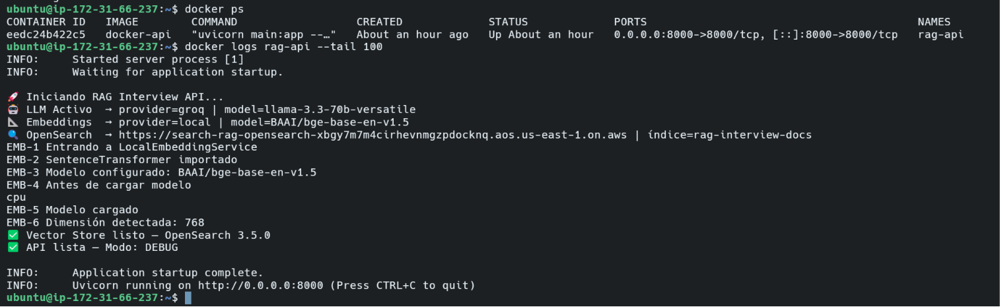

---

### 8.6 Funcionalidad del Sistema — Admin

> Esta sección evidencia las interfaces funcionales del rol de Administrador en la plataforma TechMock AI.

---

#### Dashboard Principal — Admin

*Captura pendiente: vista del dashboard del administrador con métricas de sesiones activas, usuarios registrados y evaluaciones completadas en el período actual.*

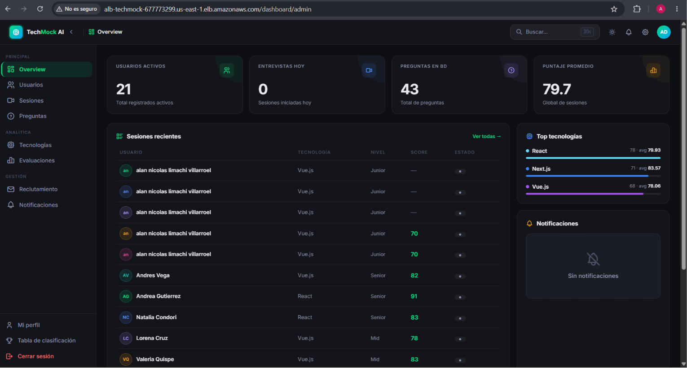

---

#### Panel de Sesiones

*Captura pendiente: historial de sesiones de entrevista realizadas, con detalle de tecnología, puntaje obtenido, duración y estado de cada sesión.*

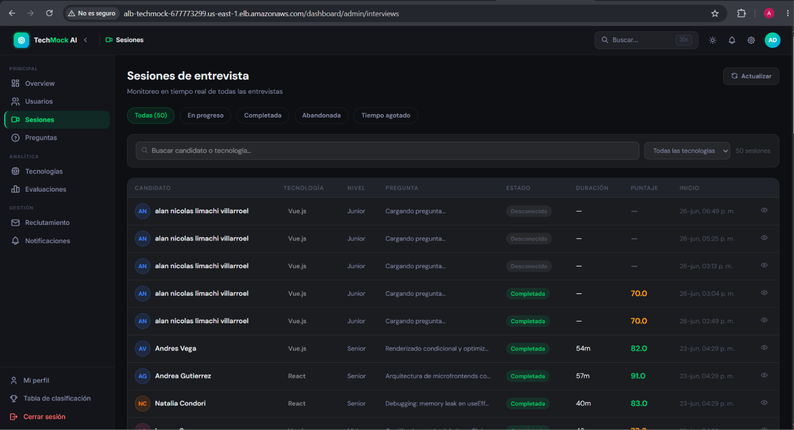

---

#### Panel de Preguntas

*Captura pendiente: repositorio de preguntas generadas por la IA, con categorización por tecnología, nivel de dificultad y estado (activa / inactiva).*

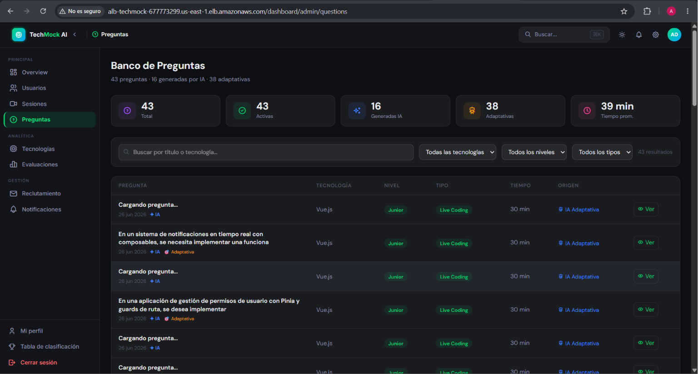

---

#### Panel de Tecnologías

*Captura pendiente: catálogo de tecnologías disponibles para práctica, con nombre, descripción, conceptos clave asociados y opción para agregar nuevas tecnologías al sistema.*

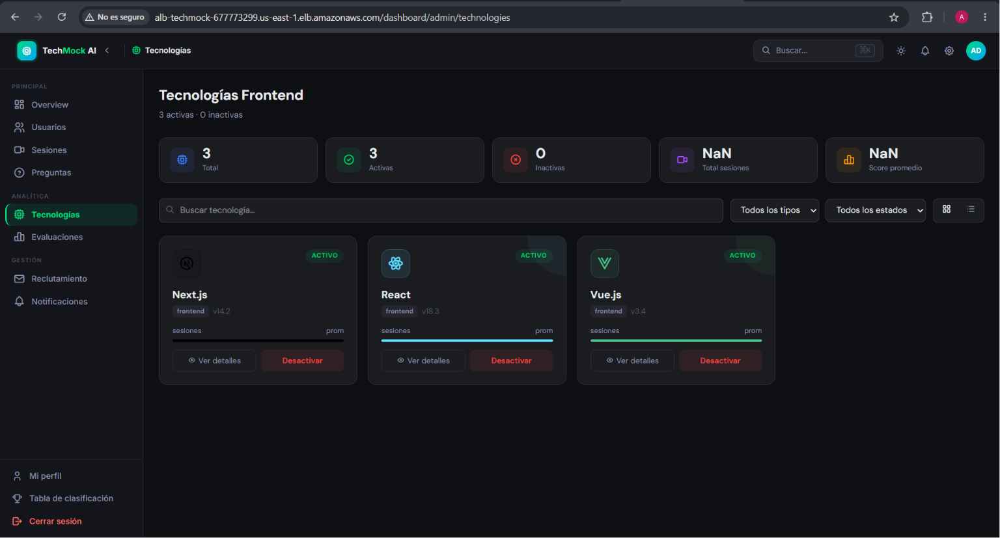

---

#### Panel de Evaluaciones

*Captura pendiente: historial de evaluaciones de código generadas por el modelo de IA, con puntajes por dimensión, errores detectados y recomendaciones emitidas por sesión.*

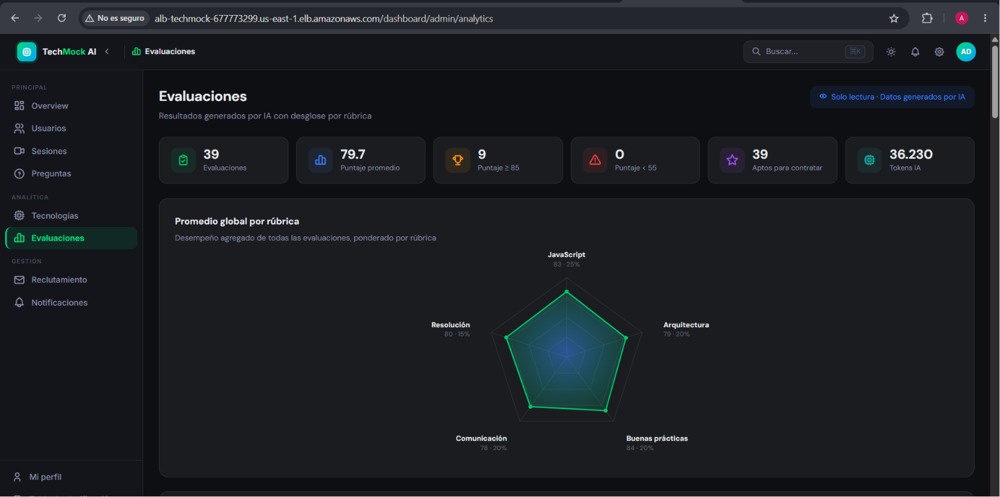
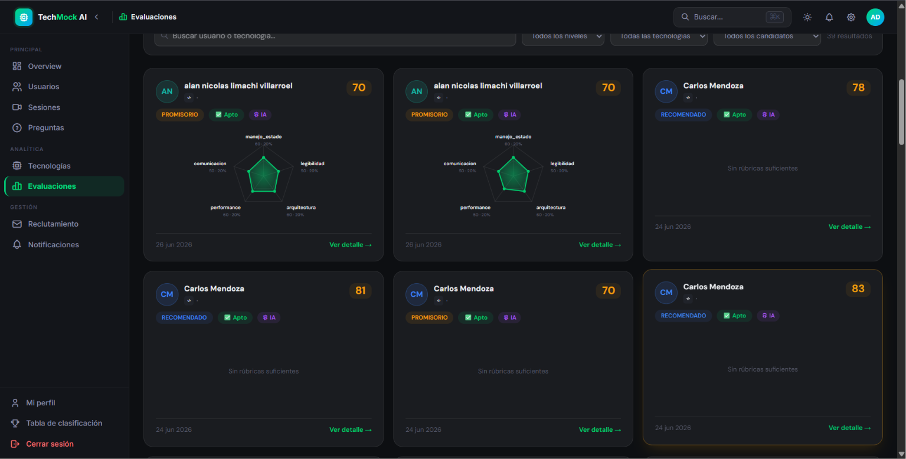
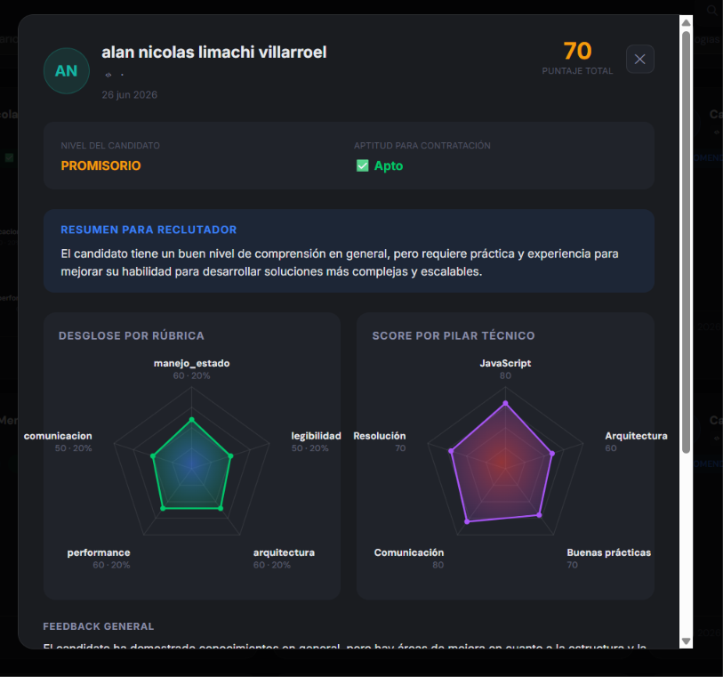

---

#### Panel de Reclutamientos

*Captura pendiente: módulo de gestión de reclutadores y perfiles de developers destacados disponibles para contacto, con controles de acceso y estado de cada solicitud.*

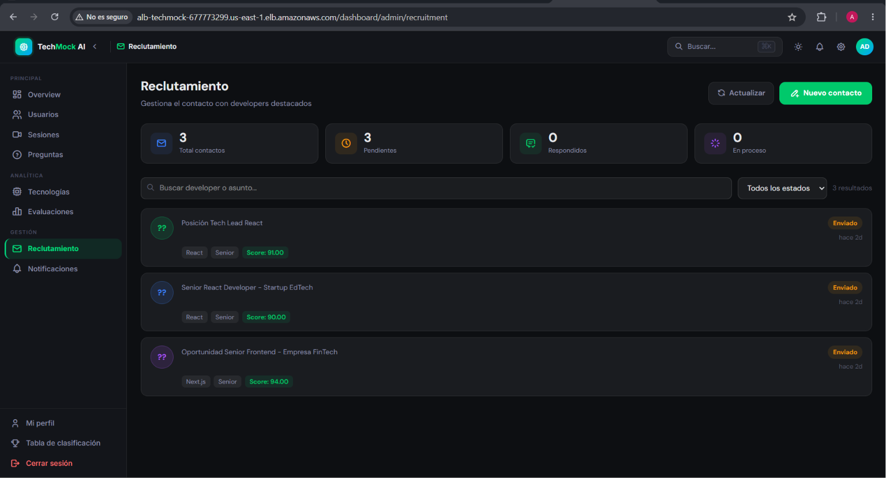

---

#### Notificaciones — Admin

*Captura pendiente: centro de notificaciones del administrador con alertas recientes sobre actividad de la plataforma, nuevos usuarios y eventos del sistema.*

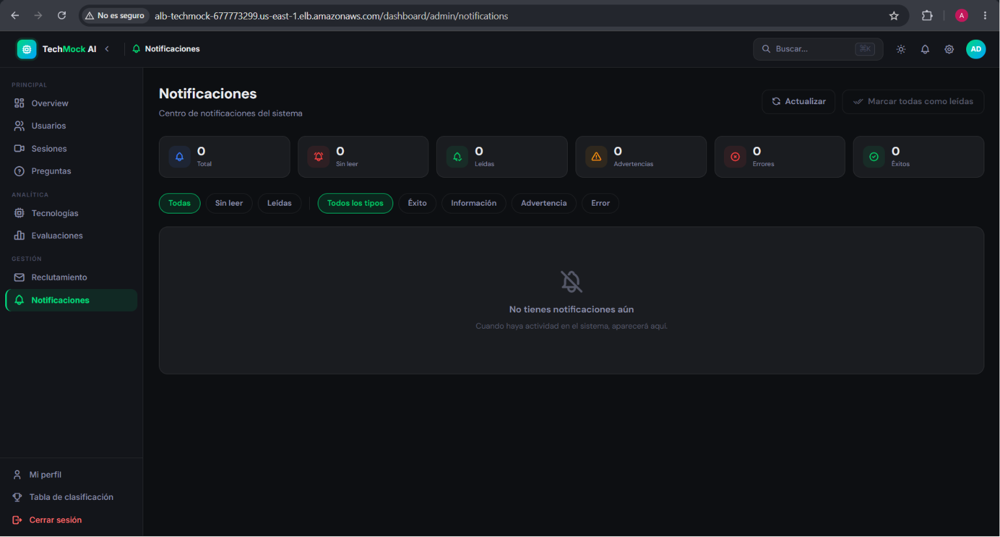

---

#### Perfil del Administrador

*Captura pendiente: página de perfil del administrador con datos personales, opciones de edición y configuración de seguridad de la cuenta.*

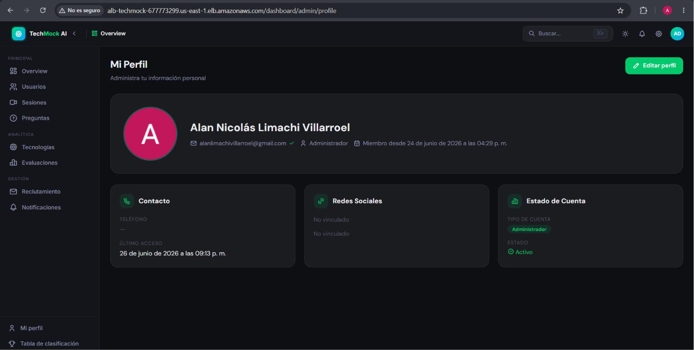

---

### 8.7 Funcionalidad del Sistema — Developer

> Esta sección evidencia las interfaces funcionales del rol de Developer en la plataforma TechMock AI.

---

#### Dashboard del Developer

*Captura pendiente: vista principal del developer mostrando el catálogo de tecnologías disponibles para iniciar una sesión y las tecnologías con progreso activo para continuar practicando.*

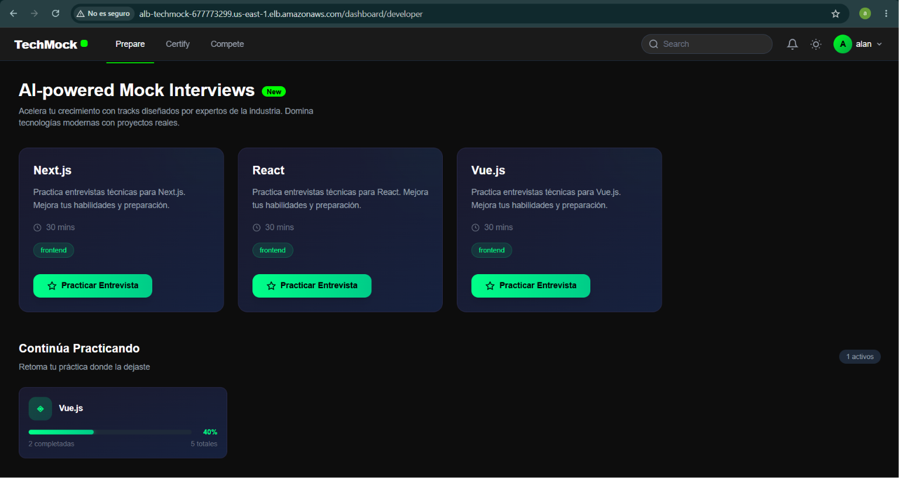

---

#### Mi Perfil — Developer

*Captura pendiente: perfil personal del developer con radar chart de competencias técnicas, estadísticas de sesiones completadas y tecnologías practicadas.*

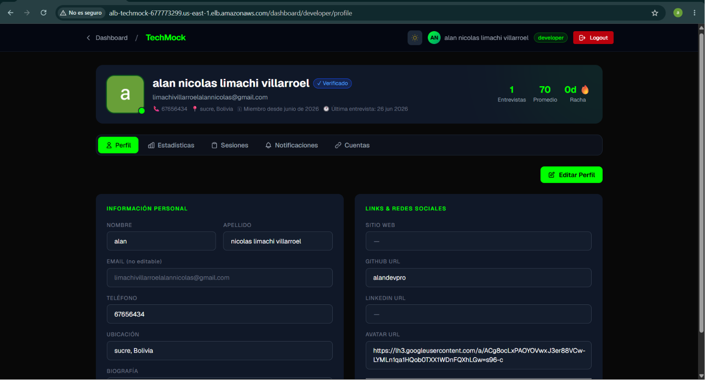

---

#### Panel de Progreso

*Captura pendiente: vista de progreso del developer con fortalezas detectadas por la IA, debilidades identificadas, mejores prácticas sugeridas y resumen de las últimas sesiones.*

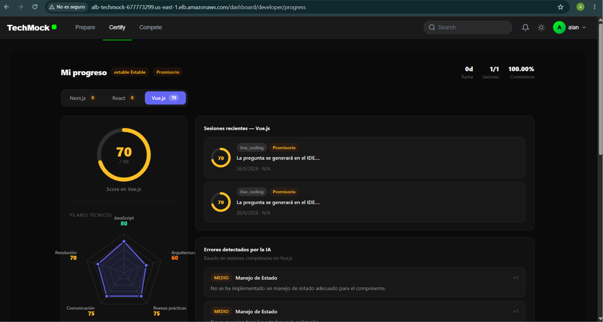

---

#### Tabla de Ranking — Developer

*Captura pendiente: clasificación global con el podio de los tres primeros developers, posición propia resaltada, puntaje acumulado y filtros por tecnología.*

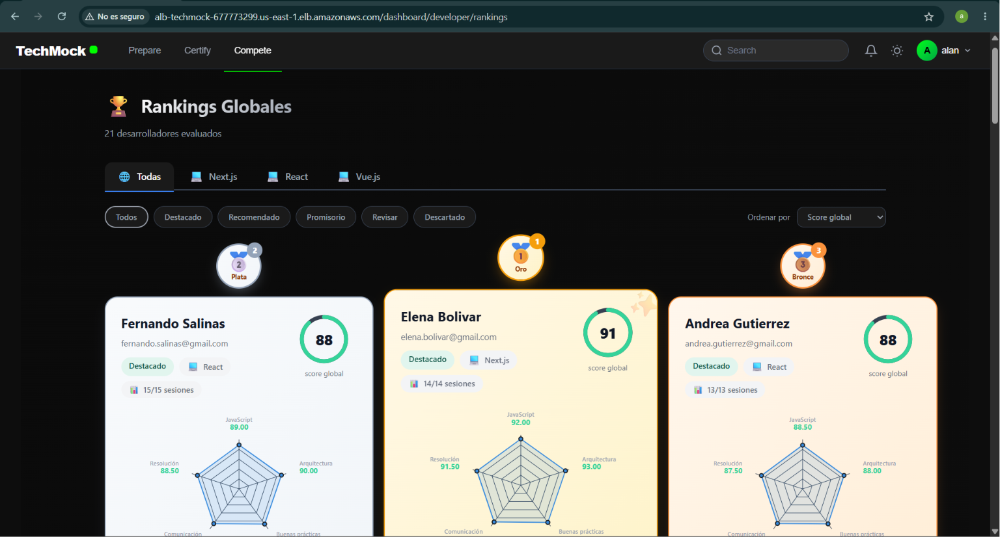
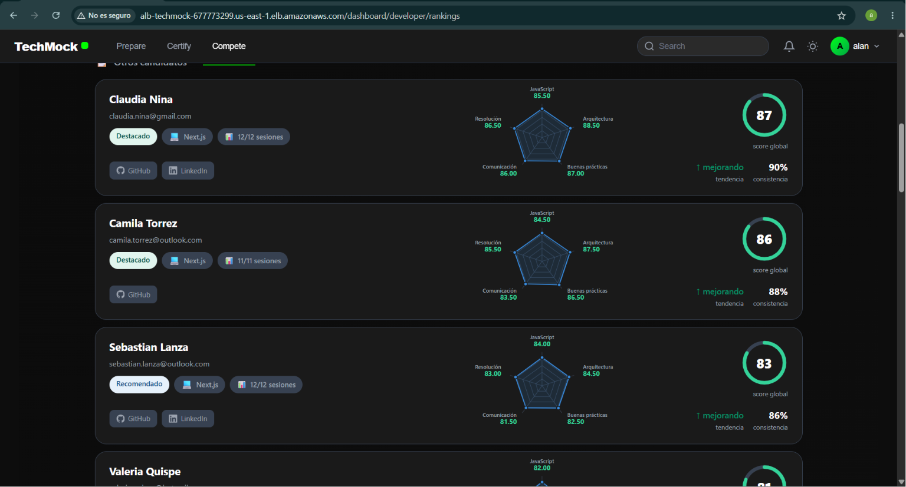

---

#### IDE — Editor de Código

*Captura pendiente: entorno de edición con la pregunta generada por la IA en el panel lateral y el editor Monaco donde el developer escribe su solución en tiempo real.*

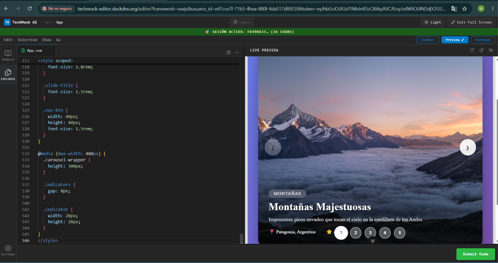

---

#### Panel de Rendimiento — Evaluación del Código

*Captura pendiente: resultado de la evaluación generada por la IA con anillos de puntaje animados por dimensión (correctitud, eficiencia, buenas prácticas, legibilidad), análisis del código, errores detectados y recomendaciones personalizadas.*

> 📌 Nombre de archivo esperado: `techmock-informe/capturas/07-funcionalidad-developer/developer-evaluacion.png`

---

## 9. Bitácora de Avance

| Fecha | Actividad | Responsable | Dificultad superada | Evidencia |
|---|---|---|---|---|
| `22-May-2026` | Dockerización del frontend y backend con Dockerfiles multi-stage y overrides dev/prod |  Alan | Errores de TypeScript: método `updateUserProfile` faltante en `AuthContext` y componente `Field` mal declarado dentro de un componente padre | `05-contenedores-docker/fronted-docker.png` |
| `26-May-2026` | Scaffolding de la capa de servicios del RAG API: rutas, orquestación RAG, modelos SQLAlchemy async y repositorios con *upsert* |  Alan | Proveedor LLM incorrecto (Ollama en lugar de Groq) por entradas duplicadas en `.env` | `07-funcionalidad-developer/developer-evaluacion.png` |
| `02-Jun-2026` | Sistema de migraciones PostgreSQL idempotente (`schema_migrations` + script maestro) y despliegue en RDS |  Alan | Garantizar idempotencia para permitir reejecuciones seguras en distintos entornos (local, staging, producción) | `02-consola-aws-rds/base.png` |
| `07-Jun-2026` | Refactor RAG API: corrección async/sync, `TabError` en `vector_store.py`, autenticación SigV4 con `boto3` y `requests-aws4auth` para OpenSearch |  Alan | Fallos intermitentes por mezcla de código síncrono y asíncrono en la capa de *retrieval* | `03-consola-aws-opensearch/` |
| `09-Jun-2026` | Configuración del ALB con 4 *listener rules* y *target groups*; ajuste de `basePath: "/editor"` en Next.js |  Alan | Los *health checks* del editor fallaban porque no reflejaban el prefijo `/editor` tras activar `basePath` | `01-consola-aws-ec2-alb/reglas.png` |
| `12-Jun-2026` | Implementación de autenticación dual Firebase + JWT y flujo de recuperación de contraseña vía SES con tokens de un solo uso |  Alan | Configuración de credenciales IAM para SES desde EC2 usando `fromInstanceMetadata()` sin exponer claves en `.env` | `04-consola-aws-ses/identidades.png` |
| `17-Jun-2026` | Pruebas de integración end-to-end: login → selección de tecnología → generación de pregunta RAG → resolución en IDE → evaluación del código |  Alan | Sincronización del flujo de datos entre el frontend, la RAG API y el backend para mantener el estado de la sesión activa | `07-funcionalidad-developer/developer-ide.png` |


---

## 10. Comandos Principales Utilizados

### 10.1 Acceso y Conexión a las Instancias EC2

```bash
# Conexión SSH a una instancia EC2
ssh -i techmock-key.pem ec2-user@<ip-publica-o-dns-ec2>

# Verificar estado del sistema y recursos disponibles
top
df -h
free -m
```

### 10.2 Variables de Entorno y Configuración

```bash
# Crear archivo de variables de entorno a partir de la plantilla
cp .env.example .env
nano .env

# Verificar que las variables se cargan correctamente en el contenedor
docker exec -it <nombre_contenedor> printenv | grep NEXT_PUBLIC
```

### 10.3 Docker — Contenedores por Servicio EC2

```bash
# Construcción de imagen de producción
docker build -t techmock-frontend:prod -f Dockerfile.prod .

# Levantar stack en modo producción
docker compose -f docker-compose.prod.yml up -d

# Verificar contenedores activos
docker ps

# Revisar logs de un servicio específico
docker logs -f <nombre_contenedor>

# Reiniciar un servicio sin reconstruir la imagen
docker compose restart <servicio>
```

### 10.4 Migraciones de Base de Datos — RDS PostgreSQL

```bash
# Conexión directa a la instancia RDS
psql -h <endpoint-rds>.rds.amazonaws.com -U <usuario> -d techmock_db

# Ejecutar el script maestro de migraciones idempotentes
./db/migrations/000_run_all_migrations.sh

# Verificar migraciones aplicadas
psql -h <endpoint-rds> -U <usuario> -d techmock_db \
  -c "SELECT * FROM schema_migrations ORDER BY applied_at;"
```

### 10.5 AWS CLI — EC2 / ALB / Target Groups / Security Groups

```bash
# Listar instancias EC2 del proyecto
aws ec2 describe-instances --filters "Name=tag:Project,Values=techmock-ai"

# Describir el balanceador de carga
aws elbv2 describe-load-balancers --names techmock-alb

# Listar target groups asociados al ALB
aws elbv2 describe-target-groups --load-balancer-arn <arn-del-alb>

# Verificar salud de los targets de un grupo
aws elbv2 describe-target-health --target-group-arn <arn-target-group>

# Revisar reglas de seguridad de un Security Group
aws ec2 describe-security-groups --group-ids <sg-id>
```

### 10.6 Amazon OpenSearch Service

```bash
# Describir el dominio de OpenSearch
aws opensearch describe-domain --domain-name techmock-vectors

# Verificar salud del clúster con autenticación SigV4
curl -XGET "https://<endpoint-opensearch>/_cluster/health" \
  --aws-sigv4 "aws:amz:us-east-1:es"

# Listar índices creados para los embeddings
curl -XGET "https://<endpoint-opensearch>/_cat/indices?v" \
  --aws-sigv4 "aws:amz:us-east-1:es"
```

### 10.7 Amazon SES

```bash
# Verificar identidad de dominio para envío de correos
aws ses verify-domain-identity --domain techmock-ai.com

# Consultar estadísticas de envío
aws ses get-send-statistics

# Listar identidades verificadas
aws ses list-identities
```

### 10.8 RAG API — FastAPI

```bash
# Levantar el servicio en modo desarrollo local
uvicorn app.main:app --host 0.0.0.0 --port 8000

# Instalar dependencias clave para integración con AWS
pip install boto3 requests-aws4auth --break-system-packages
```

### 10.9 Control de Versiones

```bash
# Registrar cambios y subir al repositorio
git add .
git commit -m "feat(alb): configurar 4 listener rules y target groups"
git push origin main

# Revisar historial para completar fechas de la bitácora
git log --pretty=format:"%ad %s" --date=short
```

---

## 11. Pendientes y Próximos Pasos

- [] Completar la verificación de dominio en Amazon SES para el envío de correos de recuperación de contraseña en producción.
- [] Finalizar la integración del flujo de autenticación dual (Firebase + JWT) en los casos de enlace de proveedores (`linkWithPopup`).
- [X] Completar pruebas end-to-end del flujo RAG: generación de preguntas → evaluación de respuestas → registro de errores → recomendaciones.
- [X] Documentar todas las variables de entorno (`.env.example`) requeridas por cada servicio, sin exponer credenciales reales en el repositorio.
- [X] Agregar la captura de Docker del servicio RAG API (`rag-docker.png`).
- [X] Agregar capturas de funcionalidad del sistema (secciones 8.6 y 8.7) con las interfaces reales de Admin y Developer.
- [X] Confirmar permisos de acceso del docente al repositorio (si es privado).
- [] Evaluar la incorporación de **Amazon CloudWatch** para monitoreo de logs, métricas y alertas sobre los 4 servicios.
- [X] Completar las regiones y endpoints reales en la Tabla de Infraestructura (sección 4).

---

## 12. Glosario de Términos

| Término | Definición |
|---|---|
| **ALB** | *Application Load Balancer* — Servicio de AWS que distribuye el tráfico HTTP/HTTPS entrante entre varios destinos según reglas configurables (en este proyecto, por *path*). |
| **RDS** | *Relational Database Service* — Servicio administrado de AWS para bases de datos relacionales. En este proyecto se usa con el motor PostgreSQL. |
| **RAG** | *Retrieval-Augmented Generation* — Técnica que combina la recuperación de información relevante (vía búsqueda vectorial) con la generación de texto de un modelo de lenguaje para producir respuestas más precisas y contextualizadas. |
| **OpenSearch Service** | Motor de búsqueda y análisis de AWS, utilizado aquí para indexar y recuperar embeddings mediante búsqueda k-NN (similitud semántica). |
| **SES** | *Simple Email Service* — Servicio de AWS para el envío de correos transaccionales, como los de recuperación de contraseña. |
| **JWT** | *JSON Web Token* — Estándar para crear tokens de acceso firmados digitalmente, utilizados para mantener sesiones de usuario sin estado en el servidor. |
| **Firebase** | Plataforma de Google utilizada como capa de identidad para el registro y login social (Google, GitHub) en TechMock AI. |
| **Target Group** | Conjunto de destinos (instancias EC2) al que el ALB enruta el tráfico según una regla específica del *listener*. |
| **SigV4** | *Signature Version 4* — Protocolo de autenticación de AWS para firmar solicitudes HTTP hacia servicios como OpenSearch Service. |
| **Embeddings** | Representaciones vectoriales de texto generadas por un modelo de ML (BGE en este caso), que permiten medir similitud semántica entre fragmentos de conocimiento. |
| **k-NN** | *k-Nearest Neighbors* — Algoritmo de búsqueda que encuentra los *k* vectores más similares a uno de consulta, utilizado por OpenSearch para recuperar el contexto más relevante en el RAG. |
| **BGE** | *BAAI General Embedding* — Modelo de embeddings de código abierto desarrollado por el Beijing Academy of AI, utilizado localmente en la RAG API para generar los vectores antes de indexarlos en OpenSearch. |
| **Monaco Editor** | Editor de código de alto rendimiento (el mismo que usa VS Code) integrado en el IDE de TechMock AI. |
| **multi-stage build** | Técnica de Docker para separar la etapa de compilación de la etapa de ejecución, generando imágenes más ligeras y seguras para producción. |

---

## 13. Control de Versiones del Documento

| Versión | Fecha | Cambios |
|---|---|---|
| 1.0 | 10/06/2026 | Versión inicial del informe de avance |
| 2.0 | 17/06/2026 | Informe ampliado: stack tecnológico, descripción detallada por componente, bitácora con evidencia asociada, comandos por sección extendidos, listado completo de capturas requeridas con rutas de archivo y glosario de términos |
| 3.0 | 26/06/2026 | Informe profesionalizado: descripción previa de cada imagen, sección completa de funcionalidad del sistema para roles Admin y Developer, flujo principal del sistema, tablas de listener rules y mejoras de formato general |

---

<div align="center">

**TechMock AI** — Plataforma de Simulación de Entrevistas Técnicas con IA

*COM610 · Grupo 6 · 2026*

</div>