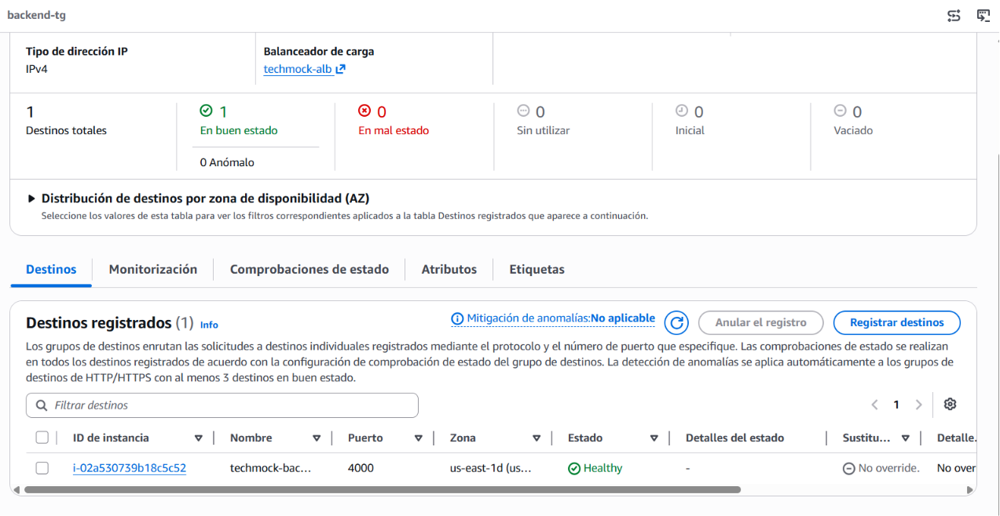
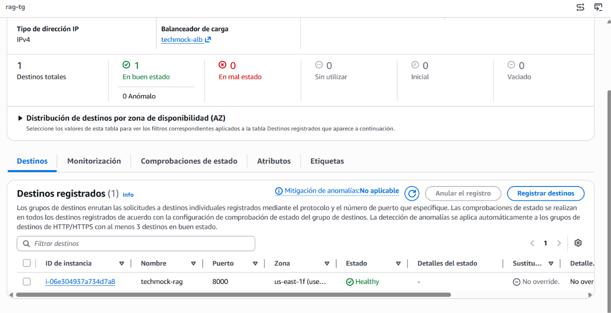
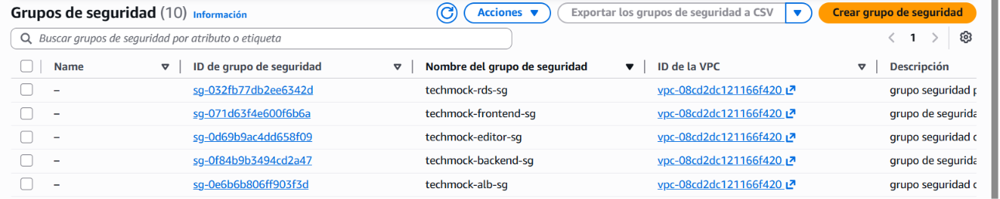
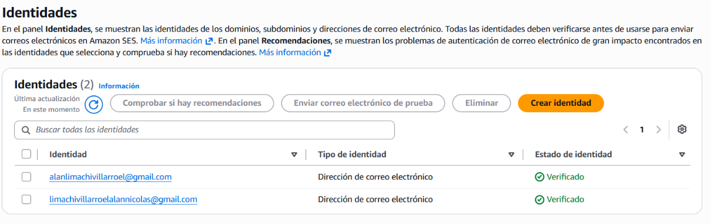
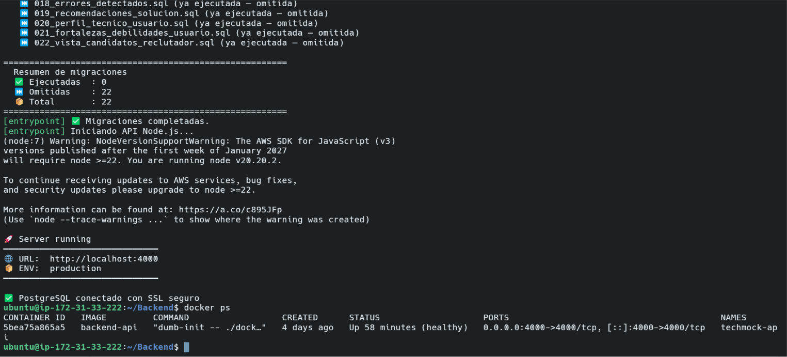

# Informe de Avance — TechMock AI


| Campo | Detalle |
|---|---|
| Curso | COM610 |
| Proyecto | TechMock AI — Plataforma de simulación de entrevistas técnicas con IA |
| Fecha del informe | 17 de junio de 2026 |
| Integrantes | Limachi Villarroel Alan Nicolas


---

## Índice

1. Resumen ejecutivo
2. Stack tecnológico
3. Tabla de infraestructura / servicios
4. Descripción detallada de cada componente
5. Diagrama de arquitectura con leyenda de estado
6. Bitácora de avance
7. Comandos principales utilizados (por sección)
8. Evidencia fotográfica / capturas de pantalla requeridas
9. Pendientes y próximos pasos
10. Glosario de términos
11. Control de versiones del documento

---

## 1. Resumen ejecutivo

TechMock AI es una plataforma que simula entrevistas técnicas de programación utilizando Inteligencia Artificial. El sistema permite a un postulante resolver ejercicios de código en un entorno tipo IDE, mientras un modelo de lenguaje (LLM), apoyado en una arquitectura RAG (*Retrieval-Augmented Generation*), genera preguntas de entrevista, evalúa las respuestas y produce recomendaciones técnicas personalizadas.

**Objetivo general:** desplegar una plataforma funcional de simulación de entrevistas técnicas, desacoplada en servicios independientes, sobre infraestructura AWS, con autenticación segura y trazabilidad de evaluación del candidato.

**Alcance de este avance:**
- Despliegue de 4 instancias EC2 (frontend, backend, editor de código, RAG API), cada una contenerizada con Docker.
- Configuración de un Application Load Balancer (ALB) con enrutamiento basado en rutas hacia los 4 servicios.
- Implementación de una base de datos relacional en Amazon RDS (PostgreSQL) con sistema de migraciones versionado.
- Integración de Amazon OpenSearch Service como motor de búsqueda vectorial para el sistema RAG.
- Configuración de Amazon SES para el envío de correos de recuperación de contraseña.
- Implementación de autenticación dual (Firebase + JWT propio) en el backend.

**Fuera de alcance en este avance** *(ajustar según corresponda)*: monitoreo y alertas (CloudWatch), CDN/Cloudfront, autoescalado, pruebas de carga.

---

## 2. Stack tecnológico

| Capa | Tecnología | Detalle / Versión |
|---|---|---|
| Frontend | Next.js (React, TypeScript) | App principal de la plataforma |
| Editor de código (IDE) | Next.js + Monaco Editor (o similar tipo VSCode) | `basePath: "/editor"` |
| Backend | Node.js + Express, TypeScript | Auth dual: Firebase + JWT propio |
| RAG API | Python + FastAPI | Orquestación RAG, SQLAlchemy async |
| Modelos LLM | Groq (predeterminado), OpenAI, Anthropic, Ollama | Cliente multi-proveedor configurable por `.env` |
| Embeddings | BGE local (`BAAI/bge-small-en-v1.5`) | Generados antes de indexar en OpenSearch |
| Base de datos | PostgreSQL (Amazon RDS) | Migraciones idempotentes (`schema_migrations`) |
| Búsqueda vectorial | Amazon OpenSearch Service | Autenticación SigV4 (`boto3` + `requests-aws4auth`) |
| Correo transaccional | Amazon SES | Recuperación de contraseña |
| Identidad | Firebase Authentication | Capa de identidad complementaria al JWT propio |
| Contenedores | Docker, Docker Compose | Build multi-stage por servicio |
| Balanceo de carga | AWS Application Load Balancer (ALB) | Enrutamiento por *path* a 4 *target groups* |
| Control de versiones | Git + GitHub | `[completar URL]` |

---

## 3. Tabla de infraestructura / servicios

| # | Servicio | Recurso AWS | Región | Función | Endpoint / Puerto interno | Estado | Dependencias | Notas técnicas |
|---|---|---|---|---|---|---|---|---|
| 1 | Frontend | EC2 (Next.js + Docker) | `[completar, ej. us-east-1]` | Interfaz de usuario principal | Puerto interno `3000` → ALB `/` | 🟩 Operativo | Backend (API), ALB | Imagen Docker multi-stage; variables `NEXT_PUBLIC_*` inyectadas en build |
| 2 | Backend | EC2 (Node.js/Express + Docker) | `[completar]` | API REST, autenticación dual, lógica de negocio | Puerto interno `4000` (ejemplo) → ALB `/api/*` | 🟨 En configuración | RDS, Firebase, SES, ALB | Integración Firebase + JWT propio en curso |
| 3 | Editor de código (IDE) | EC2 (Next.js + Docker) | `[completar]` | Entorno tipo VSCode donde el postulante escribe código | Puerto interno `3001` → ALB `/editor/*` | 🟨 En configuración | Frontend, Backend, ALB | `basePath: "/editor"`; *health check* ajustado al prefijo |
| 4 | RAG API | EC2 (FastAPI + Docker) | `[completar]` | Generación de preguntas + evaluación con IA | Puerto interno `8000` → ALB `/rag/*` | 🟨 En configuración | RDS, OpenSearch, LLM externos, ALB | Multi-proveedor LLM (Groq por defecto); embeddings BGE locales |
| 5 | Base de datos | Amazon RDS (PostgreSQL) | `[completar]` | Persistencia de usuarios, sesiones, preguntas, evaluaciones, perfiles técnicos | `[endpoint-rds].rds.amazonaws.com:5432` | 🟩 Operativo | Backend, RAG API | Migraciones idempotentes vía `schema_migrations` |
| 6 | Búsqueda vectorial | Amazon OpenSearch Service | `[completar]` | Indexación y *retrieval* de embeddings para RAG | `[dominio-opensearch].es.amazonaws.com` | 🟨 En configuración | RAG API | Autenticación SigV4 (`boto3` + `requests-aws4auth`) |
| 7 | Correo transaccional | Amazon SES | `[completar]` | Envío de correos de recuperación de contraseña | API SES (sin puerto expuesto) | 🟥 Pendiente | Backend | Pendiente verificación de dominio/identidad |
| 8 | Balanceador de carga | Application Load Balancer (ALB) | `[completar]` | Enrutamiento por *path* hacia los 4 servicios | Puerto `443/80` público | 🟩 Operativo | Las 4 instancias EC2 | *Listener rules*: `frontend-tg`, `editor-tg`, `rag-tg`, `backend-tg` |

> ⚠️ Completa región, endpoints reales y puertos exactos consultando la consola de AWS. Actualiza el campo **Estado** según la verificación más reciente antes de entregar.

---

## 4. Descripción detallada de cada componente

**Frontend (EC2 + Docker, Next.js).** Aplicación que consume la API del backend y orquesta la navegación entre el flujo de autenticación, el panel del candidato y el editor de código embebido. Se construye con un Dockerfile multi-stage que separa la etapa de compilación de la etapa de ejecución, reduciendo el tamaño final de la imagen.

**Backend (EC2 + Docker, Node.js/Express).** Expone la API REST consumida por el frontend y el editor. Implementa una arquitectura de autenticación dual: Firebase como capa de identidad (registro, login social con Google/GitHub) y un sistema de JWT propio para la gestión de sesiones y autorización dentro de la plataforma. También orquesta el envío de correos de recuperación de contraseña a través de Amazon SES.

**Editor de código / IDE (EC2 + Docker).** Entorno de edición tipo VSCode donde el candidato resuelve los ejercicios planteados durante la entrevista simulada. Se desplegó con `basePath: "/editor"` en la configuración de Next.js para que las rutas internas coincidan con la regla de enrutamiento `/editor/*` configurada en el ALB.

**RAG API (EC2 + Docker, FastAPI).** Servicio en Python encargado de generar las preguntas de entrevista y evaluar las respuestas del candidato mediante un modelo de lenguaje. Implementa el patrón RAG: primero recupera contexto relevante (conceptos, frameworks, errores comunes) desde Amazon OpenSearch usando embeddings, y luego construye un *prompt* enriquecido para el LLM activo (Groq por defecto, con soporte alternativo para OpenAI, Anthropic y Ollama).

**Base de datos (Amazon RDS — PostgreSQL).** Almacena el modelo de datos completo de la plataforma: usuarios, perfiles técnicos, sesiones de entrevista, preguntas generadas, errores detectados, recomendaciones de solución y vistas para el panel del reclutador. El control de versiones del esquema se realiza mediante una tabla `schema_migrations` y un script maestro que aplica las migraciones de forma idempotente.

**Motor de búsqueda vectorial (Amazon OpenSearch Service).** Almacena los embeddings generados localmente (modelo BGE) que representan conceptos técnicos y fragmentos de conocimiento usados por el RAG API para recuperar contexto relevante mediante búsqueda k-NN. El acceso se autentica con AWS SigV4.

**Correo transaccional (Amazon SES).** Utilizado por el backend para enviar el correo de recuperación de contraseña cuando un usuario solicita restablecer su clave, mediante un token JWT de un solo uso con expiración.

**Balanceador de carga (Application Load Balancer).** Punto de entrada único de la plataforma. Enruta el tráfico HTTP/HTTPS hacia el servicio correspondiente según el *path* de la solicitud, utilizando 4 *target groups* (uno por servicio) y reglas de prioridad configuradas en el *listener*.

---

## 5. Diagrama de arquitectura con leyenda de estado


### Leyenda de estado

| Color | Estado | Significado |
|---|---|---|
| 🟩 Verde | **Operativo** | El servicio está desplegado, probado y respondiendo correctamente en producción |
| 🟨 Amarillo | **En configuración** | El servicio está desplegado pero aún se ajustan parámetros, integración o pruebas |
| 🟥 Rojo | **Pendiente** | El servicio aún no ha sido desplegado o configurado |
| ⬜ Gris | **Externo** | Dependencia externa al control directo del equipo (Firebase, proveedores LLM) |

---

## 6. Bitácora de avance

| Fecha | Actividad | Responsable | Dificultad superada | Evidencia (carpeta/archivo) |
|---|---|---|---|---|
| `[completar]` | Dockerización profesional del frontend y backend (Dockerfiles multi-stage, overrides dev/prod) | Alan / Equipo Grupo 6 | Errores de TypeScript: método `updateUserProfile` faltante en `AuthContext` y componente `Field` mal declarado dentro de un componente padre | `05-contenedores-docker/docker-ps-frontend.png` |
| `[completar]` | Scaffolding de la capa de servicios del RAG API (rutas, orquestación RAG, modelos SQLAlchemy async, repositorios *upsert*) | Alan / Equipo Grupo 6 | Mala configuración del proveedor LLM (Ollama en lugar de Groq) por entradas duplicadas en `.env` | `07-aplicacion-funcionando/rag-pregunta-generada.png` |
| `[completar]` | Sistema de migraciones PostgreSQL idempotente (`schema_migrations` + script maestro) y despliegue en RDS | Alan / Equipo Grupo 6 | Garantizar idempotencia para permitir reejecuciones seguras en distintos entornos | `08-base-datos-queries/schema-migrations-aplicadas.png` |
| `[completar]` | Refactor RAG API: corrección async/sync, `TabError` en `vector_store.py`, autenticación SigV4 con `boto3`/`requests-aws4auth` para OpenSearch | Alan / Equipo Grupo 6 | Fallos intermitentes por mezclar código síncrono y asíncrono en la capa de *retrieval* | `03-consola-aws-opensearch/opensearch-dashboard-dominio.png` |
| `[completar]` | Configuración del ALB con 4 *listener rules* y *target groups*; ajuste de `basePath: "/editor"` | Alan / Equipo Grupo 6 | Los *health checks* fallaban porque no reflejaban el prefijo `/editor` tras activar `basePath` | `01-consola-aws-ec2-alb/alb-listeners-reglas.png` |
| `[completar]` | Implementación de autenticación dual Firebase + JWT y flujo de recuperación de contraseña vía SES | Alan / Equipo Grupo 6 | `[completar dificultad real, ej. configuración de credenciales IAM para SES desde EC2/Docker]` | `04-consola-aws-ses/ses-identidades-verificadas.png` |
| `[completar]` | Pruebas de integración end-to-end del flujo: login → editor → generación de pregunta RAG → evaluación | Alan / Equipo Grupo 6 | `[completar dificultad real]` | `07-aplicacion-funcionando/frontend-login.png` |

> 📌 Reemplaza las fechas usando `git log --pretty=format:"%ad %s" --date=short` en cada repositorio/servicio. Agrega filas adicionales si tu equipo registró más hitos relevantes (mínimo exigido: 3 entradas; aquí se incluyen 7 para mayor trazabilidad).

---

## 7. Comandos principales utilizados (por sección)

### 7.1 Acceso y conexión a las instancias EC2
```bash
# Conexión SSH a una instancia EC2 (clave .pem)
ssh -i techmock-key.pem ec2-user@<ip-publica-o-dns-ec2>

# Verificar estado del sistema y recursos
top
df -h
free -m
```

### 7.2 Variables de entorno y configuración
```bash
# Crear archivo de variables de entorno a partir de la plantilla
cp .env.example .env
nano .env

# Verificar que las variables se cargan correctamente en el contenedor
docker exec -it <nombre_contenedor> printenv | grep NEXT_PUBLIC
```

### 7.3 Docker / Contenedores (por cada servicio EC2)
```bash
# Construcción de imagen de producción
docker build -t techmock-frontend:prod -f Dockerfile.prod .

# Levantar stack en modo producción
docker compose -f docker-compose.prod.yml up -d

# Verificar contenedores activos
docker ps

# Revisar logs de un servicio específico
docker logs -f <nombre_contenedor>

# Reiniciar un servicio sin reconstruir la imagen
docker compose restart <servicio>
```

### 7.4 Migraciones de base de datos (RDS PostgreSQL)
```bash
# Conexión a la instancia RDS
psql -h <endpoint-rds>.rds.amazonaws.com -U <usuario> -d techmock_db

# Ejecutar el script maestro de migraciones idempotentes
./db/migrations/000_run_all_migrations.sh

# Verificar migraciones aplicadas
psql -h <endpoint-rds> -U <usuario> -d techmock_db -c "SELECT * FROM schema_migrations;"
```

### 7.5 AWS CLI — EC2 / ALB / Target Groups / Security Groups
```bash
# Listar instancias EC2 del proyecto
aws ec2 describe-instances --filters "Name=tag:Project,Values=techmock-ai"

# Describir el balanceador de carga
aws elbv2 describe-load-balancers --names techmock-alb

# Listar target groups asociados
aws elbv2 describe-target-groups --load-balancer-arn <arn-del-alb>

# Verificar salud de los targets de un grupo
aws elbv2 describe-target-health --target-group-arn <arn-target-group>

# Revisar reglas de seguridad de un Security Group
aws ec2 describe-security-groups --group-ids <sg-id>
```

### 7.6 Amazon OpenSearch Service
```bash
# Describir el dominio de OpenSearch
aws opensearch describe-domain --domain-name techmock-vectors

# Verificar salud del clúster (autenticado con SigV4)
curl -XGET "https://<endpoint-opensearch>/_cluster/health" \
  --aws-sigv4 "aws:amz:us-east-1:es"

# Listar índices creados
curl -XGET "https://<endpoint-opensearch>/_cat/indices?v" --aws-sigv4 "aws:amz:us-east-1:es"
```

### 7.7 Amazon SES
```bash
# Verificar identidad de dominio para envío de correos
aws ses verify-domain-identity --domain techmock-ai.com

# Consultar estadísticas de envío
aws ses get-send-statistics

# Listar identidades verificadas
aws ses list-identities
```

### 7.8 RAG API (FastAPI)
```bash
# Levantar el servicio en modo desarrollo/local
uvicorn app.main:app --host 0.0.0.0 --port 8000

# Dependencias clave para integración AWS
pip install boto3 requests-aws4auth --break-system-packages
```

### 7.9 Control de versiones
```bash
git add .
git commit -m "feat(alb): configurar 4 listener rules y target groups"
git push origin main

# Revisar historial para llenar fechas de la bitácora
git log --pretty=format:"%ad %s" --date=short
```

---

## 8. Evidencia fotográfica / capturas de pantalla requeridas

Las capturas deben guardarse dentro de la carpeta `capturas/` de este mismo paquete, respetando la subcarpeta y el **nombre de archivo exacto** indicado abajo (cada subcarpeta incluye un `INSTRUCCIONES.txt` con el mismo detalle). Inserta cada imagen en este documento usando: ``.

### 8.1 Consola AWS — EC2 / ALB (`capturas/01-consola-aws-ec2-alb/`)







| Archivo | Obligatoria | Dónde tomarla | Qué debe mostrarse |
|---|---|---|---|
| `ec2-instancias-listado.png` | Sí | EC2 → Instances | Las 4 instancias con *Name* visible y *Instance state* = `Running` |
| `alb-listeners-reglas.png` | Sí | EC2 → Load Balancers → `techmock-alb` → pestaña Listeners | Las 4 *listener rules* y su prioridad |
| `alb-target-groups-frontend-healthy.png` | Sí | EC2 → Target Groups → `frontend-tg` → pestaña Targets | Estado `healthy` del target |
| `alb-target-groups-backend-healthy.png` | Sí | EC2 → Target Groups → `backend-tg` → pestaña Targets | Estado `healthy` del target |
| `alb-target-groups-editor-healthy.png` | Sí | EC2 → Target Groups → `editor-tg` → pestaña Targets | Estado `healthy` del target |
| `alb-target-groups-rag-healthy.png` | Sí | EC2 → Target Groups → `rag-tg` → pestaña Targets | Estado `healthy` del target |
| `security-groups-reglas.png` | Opcional | EC2 → Security Groups | Reglas de entrada/salida del SG asociado a las instancias |

### 8.2 Consola AWS — RDS (`capturas/02-consola-aws-rds/`)


| Archivo | Obligatoria | Dónde tomarla | Qué debe mostrarse |
|---|---|---|---|
| `rds-instancia-detalle.png` | Sí | RDS → Databases → seleccionar instancia → pestaña Configuration | Estado `Available`, motor PostgreSQL, endpoint y puerto |
| `rds-conexion-exitosa.png` | Opcional | Terminal | Salida de `psql` conectado exitosamente al endpoint de RDS |

### 8.3 Consola AWS — OpenSearch (`capturas/03-consola-aws-opensearch/`)


| Archivo | Obligatoria | Dónde tomarla | Qué debe mostrarse |
|---|---|---|---|
| `opensearch-dashboard-dominio.png` | Sí | OpenSearch Service → Domains → dominio | Estado del clúster (`Active`/verde), número de nodos |
| `opensearch-indices-creados.png` | Opcional | Terminal o consola | Lista de índices creados para los embeddings |

### 8.4 Consola AWS — SES (`capturas/04-consola-aws-ses/`)



| Archivo | Obligatoria | Dónde tomarla | Qué debe mostrarse |
|---|---|---|---|
| `ses-identidades-verificadas.png` | Sí | SES → Verified identities | Dominio o correo en estado `Verified` |
| `ses-estadisticas-envio.png` | Opcional | SES → Account dashboard | Estadísticas de envío/entrega |

### 8.5 Contenedores activos (`capturas/05-contenedores-docker/`)



| Archivo | Obligatoria | Dónde tomarla | Qué debe mostrarse |
|---|---|---|---|
| `docker-ps-frontend.png` | Sí | Terminal SSH en la EC2 de frontend | Salida de `docker ps` con contenedor en estado `Up` |
| `docker-ps-backend.png` | Sí | Terminal SSH en la EC2 de backend | Salida de `docker ps` con contenedor en estado `Up` |
| `docker-ps-editor.png` | Sí | Terminal SSH en la EC2 del editor | Salida de `docker ps` con contenedor en estado `Up` |
| `docker-ps-rag.png` | Sí | Terminal SSH en la EC2 del RAG API | Salida de `docker ps` con contenedor en estado `Up` |


---

## 9. Pendientes y próximos pasos

- Completar la configuración y verificación de Amazon SES para el envío de correos de recuperación de contraseña.
- Finalizar la integración del flujo de autenticación dual (Firebase + JWT) en el backend.
- Completar pruebas de extremo a extremo del flujo RAG (generación de preguntas → evaluación de respuestas → recomendaciones).
- Documentar variables de entorno (`.env`) requeridas por cada servicio, sin exponer credenciales reales en el repositorio.
- Confirmar permisos de acceso del docente al repositorio (si es privado).
- Evaluar la incorporación de CloudWatch para monitoreo y alertas de los 4 servicios.

---

## 10. Glosario de términos

**ALB (Application Load Balancer):** servicio de AWS que distribuye el tráfico HTTP/HTTPS entrante entre varios destinos según reglas configurables (en este proyecto, por *path*).
**RDS (Relational Database Service):** servicio administrado de AWS para bases de datos relacionales; en este proyecto se usa con el motor PostgreSQL.
**RAG (Retrieval-Augmented Generation):** técnica que combina la recuperación de información relevante (vía búsqueda vectorial) con la generación de texto de un modelo de lenguaje.
**OpenSearch Service:** motor de búsqueda y análisis de AWS, usado aquí para indexar y recuperar embeddings mediante búsqueda k-NN.
**SES (Simple Email Service):** servicio de AWS para el envío de correos transaccionales, como los de recuperación de contraseña.
**JWT (JSON Web Token):** estándar para crear tokens de acceso firmados, usados para mantener sesiones de usuario sin estado.
**Target Group:** conjunto de destinos (instancias EC2) al que el ALB enruta el tráfico según una regla específica.

---

## 11. Control de versiones del documento

| Versión | Fecha | Cambios |
|---|---|---|
| 1.0 | 17/06/2026 | Versión inicial del informe de avance |
| 2.0 | 17/06/2026 | Informe ampliado: stack tecnológico, descripción detallada por componente, bitácora con evidencia asociada, comandos por sección extendidos, listado exacto y completo de capturas requeridas con rutas de archivo, glosario de términos |


